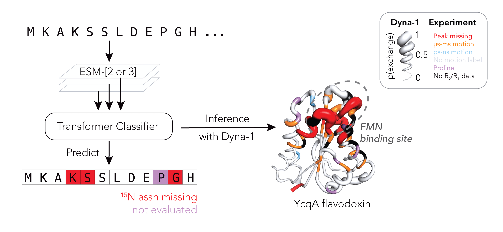

# Dyna-1
[](https://python.org/downloads)
[](https://colab.research.google.com/drive/1UD4HafhNQoz5sCwXzsrEP03fqk4ZUnTa?usp)



Dyna-1 is a model introduced in our paper, ["Learning millisecond protein dynamics from what is missing in NMR spectra"](PAPER_LINK_WHEN_READY).

Given a sequence and/or structure, Dyna-1 will predict the probability that each residue experiences micro-millisecond motions.

Dyna-1 was achieved using the `esm3-sm-open-v1` weights from ESM-3. Inference with this model is subject to the EvolutionaryScale Cambrian Non-Commercial License Agreement of the ESM-3 Model and requires read permission of the weights found [here](https://huggingface.co/EvolutionaryScale/esm3-sm-open-v1). We also make available an alternate version of Dyna-1 that uses ESM-2 embeddings; use of this model is subject to a Non-Commercial License Agreement. 

To make Dyna-1 readily accessible for research purposes, we also provide a [Google Colab](https://colab.research.google.com/drive/1UD4HafhNQoz5sCwXzsrEP03fqk4ZUnTa?usp).

We provide the curated datasets used to evaluate Dyna-1: 133 curated R1/R2/NOE datasets "RelaxDB" and 10 relaxation-dispersion Carr-Purcell-Meiboom-Gill datasets "RelaxDB-CPMG". 

In this repository we provide:
* [Installation](#installation)
* [Inference code for Dyna-1](#inference)
* [PyMol visualization](#visualization)
* [RelaxDB and RelaxDB-CPMG datasets](#datasets)
* [Training code for Dyna-1](#training)
* [Citation](#citation)
* [Acknowledgements](#acknowledgement)

If you have any questions not covered here, please create an issue and we will get back to you ASAP.

# Installation 
To run the scripts in this repository, we recommend using a conda environment. First, clone this repository. Then navigate to the root directory and run:
```
conda create -n dyna1 python=3.11
conda activate dyna1
```
This package requires PyTorch, ideally with GPU support. For more information, follow instructions from https://pytorch.org/get-started/locally/ for your system and CUDA version. We used PyTorch 2.5.0 with CUDA 12.4. To install all of the requirements:
```
pip install -r requirements.txt
```
Then, download the model weights and upload them to the `model/weights` folder. More information on how to download them can be found <a href='https://github.com/gelnesr/Dyna-1-public/blob/main/model/weights/README.md'>here</a>. 

# Inference

The best-performing Dyna-1 is based on ESM-3. To run this version, you will have to request access to the ESM-3 `esm3-sm-open-v1` weights at HuggingFace [here](https://huggingface.co/EvolutionaryScale/esm3-sm-open-v1). Follow the steps to agree to their License terms and receive your access token to the model weights. 

> [!NOTE]
> If this is your first time requesting access to the ESM-3 weights, you may need to set up your access token. For more information on how to set up an SSH token, please consult <a href='https://huggingface.co/docs/hub/en/security-git-ssh'>this</a> tutorial. Alternatively, you can use the huggingface login prompt, which will prompt you for the access token each time you re-instantiate Dyna-1. This can be configured by adding the following code to the inference script: `from huggingface_hub import login; login()` 

To run inference using our best-performing model, run:

```
python dyna1.py --pdb <PDB CODE or PATH> --chain <CHAIN> --name <NAME> --use_pdb_seq --write_to_pdb
```

We provide three options for running inference: sequence and structure input (best performance!), sequence only, or structure only. Additionally, we make it possible to test different sequences for the same backbone. Examples on how to run each of these modes can be found in the `scripts/` folder. 

To output the probabilities to the input structure, make sure to pass the `--write_to_pdb` flag.

Alternatively, we also provide a version of Dyna-1 based on ESM-2. To run inference using this version of the model, run:

```
python dyna1-esm2.py --sequence <SEQUENCE> --name <NAME>
```

# Visualization

We visualize probabilities of exchange on protein structures using [PyMol](https://www.pymol.org). To re-create the putty visualization on your protein, import the pdb file into PyMol and copy-paste the following commands into the PyMol command line:

```
cartoon putty; set cartoon_putty_transform, 6; set cartoon_putty_radius, 0.25; set cartoon_putty_range, 0.1; set cartoon_putty_scale_max, 10
```

Annotated:
```
cartoon putty
set cartoon_putty_transform, 6 #scaled linear transformation
set cartoon_putty_radius, 0.25 # min radius for p=0
set cartoon_putty_range, 0.1 # min_radius / max_radius, sets max_radius=2.5
set cartoon_putty_scale_max, 10 #max_radius / min_radius
```

# Datasets

*RelaxDB* contains 133 R1/R2/NOE datasets curated from the [BMRB](https://bmrb.io/) and from literature.

*RelaxDB-CPMG* contains motion labels derived from 10 CPMG relaxation-dispersion datasets curated from literature.

Data formatted for input into Dyna-1 is in `data/RelaxDB_pkls_22jan2025.zip`.

Datasets in json format is in `data/RelaxDB_datasets/`.

See `analysis/` for demo notebooks for visualizing and using datasets to evaluate model outputs.

# Training

Training code will be made available upon journal publication.

# Citation

If you are using our code, datasets, or model, please use the following citation:
```bibtex
@article {Dyna-1,
    author = {Wayment-Steele, Hannah K. and El Nesr, Gina and Hettiarachchi, Ramith and Kariyawasam, Hasindu and Ovchinnikov, Sergey and Kern, Dorothee},
    title = {Learning millisecond protein dynamics from what is missing in NMR spectra},
    year = {2025},
    doi = {},
    journal = {bioRxiv}
}
```
# Acknowledgements

We would like to acknowledge the Evolutionary Scale Team for their contributions to the field with ESM-3. The code in `esm` is imported from `evolutionaryscale/esm` with all modifications identified and includes the associated LICENSE terms for the ESM-3 model.

We would also like to acknowledge the FAIR Team for their contributions to the field with ESM-2. The ESM-2 model is called using the HuggingFace API call.

We thank Katie Henzler-Wildman, Magnus Wolf-Watz, Elan Eisenmesser, J. Patrick Loria, Marcellus Ubbelink, George Lisi, Sam Butcher, and Nicolas Doucet for sharing data. We thank Martin Stone for sharing the Indiana Dynamics Database data his group curated in 2000.
